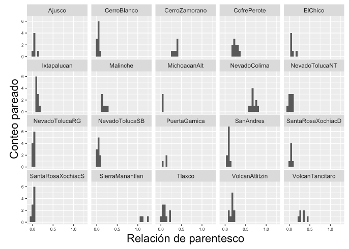

# README GENOMICS

## Pre-requisitos

Before starting the analysis here are the programs that need to be installed:

## SOFTWARE

* [ipyrad](https://ipyrad.readthedocs.io/en/latest/)
* [PLINK](https://www.cog-genomics.org/plink2/)
* [vcfTools](https://vcftools.github.io/man_latest.html)
* [R](https://cran.r-project.org)
* [Rstudio (optional)](https://rstudio.com)

## R packages

* **readr**
* **dplyr**
* **tidyr**
* **ggplot2**
* **geosphere**
* **gdsfmt**
* **SNPRelate**
* **MASS**
* **psych**
* **vegan**
* **permute**
* **lattice**
* **magrittr**
* **reshape**

## GENOMICS directory structure:

```
+----- Abies_religiosa_vs_ozone/
|	+--GENOMICS/
|		+--bin/
|	     +--Rstudio/
|	   	    +--3.3_Without_SNPs_in_same_loci.R
|	   	    +--4.2_Relatedness.R
|	   	    +--5.1_Mantel_test.R
|	   	    +--6.1_PCA.R
|	   	    +--7.3_Admixture.R
|	   	    +--8.2_Calculate_He.R
|	     +--Software
|	   	    +--1.1_Run_relaxed_assembly.sh
|	   	    +--2.3_Samples_missdata_maf.sh
|	   	    +--3.1_Calculate_frequences.sh
|	   	    +--3.2_ConvertFiles_vcf_to_plink.sh
|	   	    +--3.4_Extract_positions_HM.sh
|	   	    +--5.1_Calculate_relatedness.sh
|	   	    +--7.1_Calculate_CV_Admixture.sh
|	   	    +--8.1_Calculate_Heterozigozity.sh
|		+--data/
|		+--metadata/
|		+--outputs/
|		+--README_genomics.md
```
## GENOMICS content

:file_folder: **`/bin`**
Here you will find the scripts that are needed to perform the analyses. The scripts must be used in the order specified.

:file_folder: **`/data`** Aqui se encuentran los archivos producto de la secuenciacion y el analisis de ellos

:file_folder: **`/metadata`** Aqui se encuentran

:file_folder: **`/outputs`**

:page_facing_up: **`/README_genomics`**


# 1.0.-RUN de novo ASSEMBLY

Relaxed assembly iPyRAD with *Abies flinckii* and *Abies religiosa*

* **INPUT**:
   * Archivos de la secuenciación **files.fq.gz**
   * barcodes **file.txt**

* **OUTPUT**:
   * **file.vcf**(.vcf)

## 1.1.-Run relaxed assembly with ipyrad
SCRIPT in 1.-GENOMICS/Software/[1.1_Run_relaxed_assembly.sh](bin/Software/1.1_Run_relaxed_assembly.sh)

```
ipyrad -p TMVB_5SNPrad.vcf -s 1234567 -f
```
**PARAMS FILE**
```
------- ipyrad params file (v.0.7.28)-------------------------------------------
TMVB_5SNPradlocus              ## [0] [assembly_name]: Assembly name. Used to name output directories for assembly steps
/LUSTRE/Genetica/gibrahim/ipyrad_Abies ## [1] [project_dir]: Project dir (made in curdir if not present)
                               ## [2] [raw_fastq_path]: Location of raw non-demultiplexed fastq files
Merged: Plate1rawsAbies, Plate2rawsAbies, Plate3rawsAbies, Plate4rawsAbies, Plate5rawAbies ## [3] [barcodes_path]: Location of barcodes file
                               ## [4] [sorted_fastq_path]: Location of demultiplexed/sorted fastq files
denovo                         ## [5] [assembly_method]: Assembly method (denovo, reference, denovo+reference, denovo-reference)
                               ## [6] [reference_sequence]: Location of reference sequence file
gbs                            ## [7] [datatype]: Datatype (see docs): rad, gbs, ddrad, etc.
TGCAG, CGG                     ## [8] [restriction_overhang]: Restriction overhang (cut1,) or (cut1, cut2)
0                              ## [9] [max_low_qual_bases]: Max low quality base calls (Q<20) in a read
43                             ## [10] [phred_Qscore_offset]: phred Q score offset (33 is default and very standard)
8                              ## [11] [mindepth_statistical]: Min depth for statistical base calling
8                              ## [12] [mindepth_majrule]: Min depth for majority-rule base calling
10000                          ## [13] [maxdepth]: Max cluster depth within samples
0.9                            ## [14] [clust_threshold]: Clustering threshold for de novo assembly
0                              ## [15] [max_barcode_mismatch]: Max number of allowable mismatches in barcodes
2                              ## [16] [filter_adapters]: Filter for adapters/primers (1 or 2=stricter)
80                             ## [17] [filter_min_trim_len]: Min length of reads after adapter trim
2                              ## [18] [max_alleles_consens]: Max alleles per site in consensus sequences
0                              ## [19] [max_Ns_consens]: Max N's (uncalled bases) in consensus (R1, R2)
4, 4                         ## [20] [max_Hs_consens]: Max Hs (heterozygotes) in consensus (R1, R2)
1                              ## [21] [min_samples_locus]: Min # samples per locus for output
5, 5                         ## [22] [max_SNPs_locus]: Max # SNPs per locus (R1, R2)
4, 4                           ## [23] [max_Indels_locus]: Max # of indels per locus (R1, R2)
0.5                            ## [24] [max_shared_Hs_locus]: Max # heterozygous sites per locus (R1, R2)
0, 0, 0, 0                     ## [25] [trim_reads]: Trim raw read edges (R1>, <R1, R2>, <R2) (see docs)
0, 0, 0, 0                     ## [26] [trim_loci]: Trim locus edges (see docs) (R1>, <R1, R2>, <R2)
p, s, v, k, n, g               ## [27] [output_formats]: Output formats (see docs)
                               ## [28] [pop_assign_file]: Path to population assignment file
```

# 2.0.-Strict assembly vcfTools and PLINK
I used 79 samples of my research group to understand were is the providence of my 10 samples. So, I do my assembly with 89 samples.
This assembly was made relaxed because we want found SNPs with same ID reference in every sequences.
Se requiere sacar del ensamble general solamente a las muestras de Abies religiosa (89 individuals)

* **INPUT**:
   * **file.vcf** (TMVB_5SNPrad.vcf)

* **OUTPUT**:
   * **fitered_file.vcf**(88ind_maxmiss0.9_maf0.05.recode.vcf)

## 2.1.-Check perfect missing data max for your samples


## 2.2.-Check perfect maf for your samples

## 2.3.-Selected samples, missing data and maf. Only 89 *Abies religiosa* samples with missing data max 10% and maf 0.05
SCRIPT in 1.-GENOMICS/Software/[2.3_Samples_missdata_maf.sh](bin/Software/2.3_Samples_missdata_maf.sh)

```
vcftools --vcf TMVB_5SNPradlocus.vcf --keep 89_ind.txt --max-missing 0.9 --maf 0.05 --recode --out 89ind_maxmiss0.9_maf0.05
```
**OUT: fitered_file.vcf**

# 3.0.-Make LD linkage desequilibrium (delete a SNPs in the same loci)


* **INPUT**:
   * **fitered_file.vcf**(88ind_maxmiss0.9_maf0.05.recode.vcf)

* **OUTPUT**:
   * **fitered_file.freq**(freq_88ind_maxmiss0.9_maf0.05.frq)
   * **fitered_file.bed**(88ind_maxmiss0.9_maf0.05.bed)
   * **fitered_file.bim**(88ind_maxmiss0.9_maf0.05.bim)
   * **fitered_file.fam**(88ind_maxmiss0.9_maf0.05.fam)
   * **positions.txt**(positions_s88_Ar0.9.txt)
   * **snp_withoutDupLoci.bed**(snp_withoutDupLoci_88s_maxmiss0.9_maf0.05.bed)
   * **snp_withoutDupLoci.bim**(snp_withoutDupLoci_88s_maxmiss0.9_maf0.05.bim)
   * **snp_withoutDupLoci.fam**(snp_withoutDupLoci_88s_maxmiss0.9_maf0.05.fam)

## 3.1.-Primero se tiene que obtener la frecuencia que tienen los loci

SCRIPT in 1.-GENOMICS/Software/[3.1_Calculate_frequences.sh](bin/Software/3.1_Calculate_frequences.sh)

Para descartar SNPs de un mismo locus necesitamos calcular las frecuencias de cada SNP. Utilizamos la flag --freq. Este comando nos arroja los datos en un archivo que podemos leer como .txt en la terminal de R

```
vcftools --vcf 88ind_maxmiss0.9_maf0.05.recode.vcf --freq --out freq_88ind_maxmiss0.9_maf0.05

```

**OUT: fitered_file.freq**

Modificar el archivo .freq sustituyendo los " " por ":". De esta manera podremos cargar el archivo .freq en R

locus_13 8
locus_13:8

## 3.2.-Convertir archivos vcf en plink

Para descartar SNPs de un mismo locus necesitamos transformar el archivo .vcf a .bam/.bim/.fam

SCRIPT in 1.-GENOMICS/Software/[3.2_ConvertFiles_vcf_to_plink.sh](bin/Software/3.2_ConvertFiles_vcf_to_plink.sh)

```
vcftools --vcf 88ind_maxmiss0.9_maf0.05.recode.vcf --plink --out 88ind_maxmiss0.9_maf0.05
```
**OUT: fitered_file.freq, fitered_file.bed, fitered_file.bim**


## 3.3.-Utilizar el archivo .freq para extraer solamente SNPs con valores de maf altos

Con este script se descartan locus con más de un SNP. El archivo .txt resultante contiene las posisiones de SNPs que deseamos conservar en los siguentes archivos.

SCRIPT in 1.-GENOMICS/Rstudio/[3.3_Without_SNPs_in_same_loci.R](bin/Rstudio/3.3_Without_SNPs_in_same_loci.R)

**OUT: positions_s88_Ar0.9.txt**

## 3.4.-Extraer posisiones en archivos plink con el outfile del paso 3.3

El archivo .txt producto del paso 3.3 se requiere para formar un nuevo archivo.vcf sin loci con mas de un SNP.

SCRIPT in 1.-GENOMICS/Software/[3.4_Extract_positions_HM.sh](bin/Software/3.4_Extract_positions_HM.sh)
```
./plink --file 88ind_maxmiss0.9_maf0.05 --extract positions_s88_Ar0.9.txt  --make-bed --out snp_withoutDupLoci_88s_maxmiss0.9_maf0.05
```
**OUT: snp_withoutDupLoci.bed, snp_withoutDupLoci.bim, snp_withoutDupLoci.fam**

# 4.0.-Calcular coeficiente de relación (relatedness)

* **INPUT**:
  * **snp_withoutDupLoci.bed**(snp_withoutDupLoci_88s_maxmiss0.9_maf0.05.bed)
  * **snp_withoutDupLoci.bim**(snp_withoutDupLoci_88s_maxmiss0.9_maf0.05.bim)
  * **snp_withoutDupLoci.fam**(snp_withoutDupLoci_88s_maxmiss0.9_maf0.05.fam)

* **OUTPUT**:
  * **Relatedness_images**
  * **relsnp_snp_withoutDupLoci.rel**(relsnp_snp_withoutDupLoci_88ind_maxmiss0.9_maf0.05.rel)
  * **relsnp_snp_withoutDupLoci.id**(relsnp_snp_withoutDupLoci_88ind_maxmiss0.9_maf0.05.rel.id)
  * **relsnp_snp_withoutDupLoci.bim**(relsnp_snp_withoutDupLoci_88ind_maxmiss0.9_maf0.05.bim)
  * **relsnp_snp_withoutDupLoci.bed**(relsnp_snp_withoutDupLoci_88ind_maxmiss0.9_maf0.05.rel.bed)
  * **relsnp_snp_withoutDupLoci.fam**(relsnp_snp_withoutDupLoci_88ind_maxmiss0.9_maf0.05.rel.fam)

## 4.1.-Se calcula con PLINK1.9, los archivos se convierten a plink y a vcf, utilizando los siguientes comandos:

SCRIPT in 1.-GENOMICS/Software/[4.1_Calculate_relatedness.sh](bin/Software/4.1_Calculate_relatedness.sh)
```
./plink --bfile snp_withoutDupLoci_without_duplicates88s_maxmiss0.9_maf0.05 --make-rel square --make-bed --out relsnp_withoutDupLoci_without_duplicates88s_maxmiss0.9_maf0.05
```
**OUT: relsnp_snp_withoutDupLoci.rel, relsnp_snp_withoutDupLoci.id, relsnp_snp_withoutDupLoci.bim, relsnp_snp_withoutDupLoci.bed, relsnp_snp_withoutDupLoci.fam**

## 4.2.-plot Relatedness
SCRIPT in 1.-GENOMICS/Rstudio/[4.2_Relatedness.R](bin/Rstudio/4.2_Relatedness.R)

**OUT: Relatedness_images**



# 5.0.-Mantel test

* **INPUT**:
  * **Loc_Long_Lat.txt**(Ar_IBD2.txt)
  * **fitered_file.vcf**(88ind_maxmiss0.9_maf0.05.recode.vcf)
  * **namesample_pops**(FST_VCFTools_Ar88.txt)
  * **pops_paired**(Ar_IBD_comparaciones.txt)

* **OUTPUT**:
  * **file.gds**(88ind_maxmiss0.9_maf0.05.recode.gds)
  * **Mantel_test_images**


## 5.1.-
SCRIPT in 1.-GENOMICS/Rstudio/[5.1_Mantel_test.R](bin/Rstudio/5.1_Mantel_test.R)

**OUT: Mantel_test_images**


# 6.0.-Estructura genética de las poblaciones con PCA

* **INPUT**:
  * **fitered_file.vcf**(88ind_maxmiss0.9_maf0.05.recode.vcf)
  * **info_samples.csv**(PLACA_FINAL_88_samples.csv)


* **OUTPUT**:
  * **snp_withoutDupLoci.gsd**(snp_withoutDupLoci_88s_maxmiss0.9_maf0.05_pca.gds)
  * **PCA_images**

## 6.1.-Plot PCA
SCRIPT in 1.-GENOMICS/Rstudio/[6.1_PCA.R](bin/Rstudio/6.1_PCA.R)

**OUT: PCA_images**


# 7.0.-Estructura genética de las poblaciones con admixture

* **INPUT**:
  * **logall.txt**(logall_snp_withoutDupLoci_88s_maxmiss0.9_maf0.05.txt)
  * **snp_withoutDupLoci.bed**(snp_withoutDupLoci_88s_maxmiss0.9_maf0.05.bed)
  * **snp_withoutDupLoci.fam**(snp_withoutDupLoci_88s_maxmiss0.9_maf0.05.fam)
  * **snp_withoutDupLoci.2.Q**(snp_withoutDupLoci_88s_maxmiss0.9_maf0.05.2.Q)
  * **snp_withoutDupLoci.3.Q**(snp_withoutDupLoci_88s_maxmiss0.9_maf0.05.3.Q)
  * **snp_withoutDupLoci.4.Q**(snp_withoutDupLoci_88s_maxmiss0.9_maf0.05.4.Q)
  * **snp_withoutDupLoci.5.Q**(snp_withoutDupLoci_88s_maxmiss0.9_maf0.05.5.Q)

* **OUTPUT**:
  * **cross_validation_images**
  * **Admixture_images**

## 7.1.-Run admixture
Cada vez que corro un admixture debo cambiar de lugar los archivos, de lo contrario se sobreescriben

SCRIPT in 1.-GENOMICS/Software/[7.1_Calculate_CV_Admixture.sh](bin/Software/7.1_Calculate_CV_Admixture.sh)
```
for K in 1 2 3 4 5 6 7 8 9 10 11 12 13 14 15 16 17 18 19 20;
do ./admixture --cv=20 snp_withoutDupLoci_88s_maxmiss0.9_maf0.05.bed $K | tee log${K}.out; done
grep -h CV log*.out > logall_snp_withoutDupLoci_88s_maxmiss0.9_maf0.05
```

## 7.2.-Modificar el logall.txt y el archivo .fam

```
CV error (K=1): 0.44124
01	0.86369

fam file

ArDlD5	ArDlD5	0	0	0	-9
SantaRosaXochiac	ArDlD5	0	0	0	-9
```
## 7.3.-Admixture Plot
SCRIPT in 1.-GENOMICS/Rstudio/[7.3_Admixture.R](bin/Rstudio/7.3_Admixture.R)

**OUT: cross_validation_images, Admixture_images**


# 8.0.-Calculate Heterocigozity

* **INPUT**:
  * **snp_withoutDupLoci.vcf**(snp_withoutDupLoci_88s_maxmiss0.9_maf0.05.vcf)
  * **samples_name.txt**(samples_het_relat.txt)
* **OUTPUT**:
  * **het.het**(samples_het_snp_withoutDupLoci_10ind_maxmiss0.9_maf0.05.het)

## 8.1.- Calculate_Heterozigozity in PLINK

SCRIPT in 1.-GENOMICS/Software/[8.1_Calculate_Heterozigozity.sh](bin/Software/8.1_Calculate_Heterozigozity.sh)
```
vcftools --vcf snp_withoutDupLoci_88s_maxmiss0.9_maf0.05.vcf --keep samples_name.txt --het --out samples_he_snp_withoutDupLoci_10ind_maxmiss0.9_maf0.05.het
```
## 8.2.- Calculate_Heterozigozity
SCRIPT in R 1.-GENOMICS/Rstudio/[8.2_Calculate_He.R](bin/Rstudio/8.2_Calculate_He.R)
