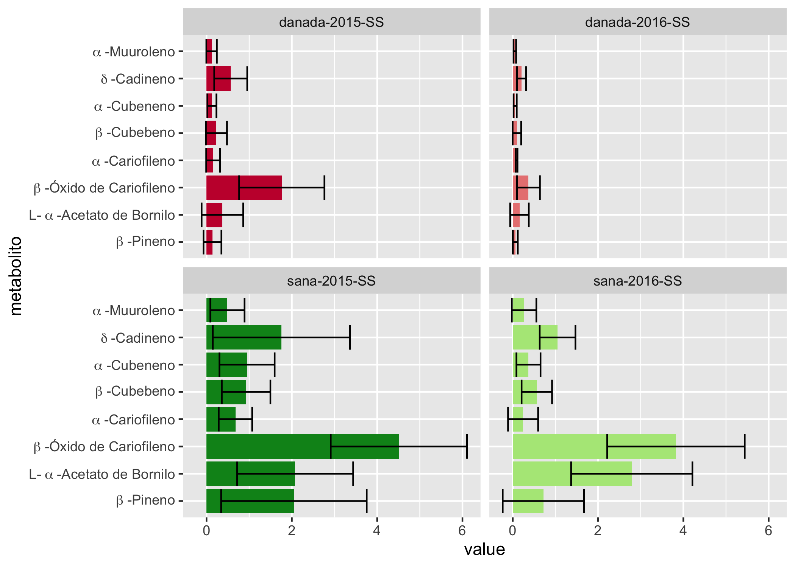

# README METABOLOMICS

## Pre-requisitos

Before starting the analysis here are the programs that need to be installed:

## SOFTWARE

* [R](https://cran.r-project.org)
* [Rstudio (optional)](https://rstudio.com)

## R packages

* **ggplot2**
* **reshape2**
* **ggfortify**
* **corrplot**


## METABOLOMICS directory structure:

```
+----- Abies_religiosa_vs_ozone/
|	+--2.-METABOLOMICS/
|		+--bin/
|	       +--Rstudio/
|	   	       +--1.1.-Make_df_allsamples_metabol.R
|	    	     +--2.1.-Calculate_relative_abs.R
|	   	       +--3.1.-ANOVA.R
|	   	       +--4.1.-Barplots
|	   	       +--5.1.-PCA.R
|	   	       +--Load_html_files.R
|		+--data/
|	       +--GC-MS/
|	   	       +--LibSrch_3.htm
|	   	       +--LibSrch_5.htm
|		+--metadata/
|	       +--Tablas_datos/
|	   	       +--htm_df.txt
|	   	       +--exp_table.txt
|	   	       +--exp_table.csv
|	   	       +--calculate_relative_abs.txt
|		+--outputs/
|	   	   +--barplot_images_conti.png
|	       +--barplot_images_SS.png
|		+--README_genomics.md
```
## METABOLOMICS content

:file_folder: **`/bin`**
Here you will find the scripts that are needed to perform the analyses. The scripts must be used in the order specified.

:file_folder: **`/data`** Aqui se encuentran los archivos producto de la secuenciacion y el analisis de ellos

:file_folder: **`/metadata`** Aqui se encuentran

:file_folder: **`/outputs`**

:page_facing_up: **`/README_metabolomics`**

# 1.- Load data by GC-MS

pk (pico), RT (tiempo de retención), Area % (porcentaje de área) CAS# (número CAS) y Qual (valor)

* **INPUT**:
  * **LibSrch_#.htm**(LibSrch_3.htm, LibSrch_4.htm, etc.)

* **OUTPUT**:
  * **htm_df.txt**(htm_df.txt)

## 1.1.-plot Relatedness
SCRIPT in 2.-METABOLOMICS/Rstudio/[1.1.-Make_df_allsamples_metabol.R](bin/Rstudio/1.1.-Make_df_allsamples_metabol.R)

**OUT: htm_df.txt**

# 2.- Calculate_relative_abs

Se utilizó el siguiente script para calcular la cantidad de metabolitos

* **INPUT**:
  * **metabolitos.csv**(metabolitos_Tesis_Vero.csv)

* **OUTPUT**:
  * **calculate_relative_abs.txt**(calculate_relative_abs.txt)

## 2.1.-Calculate_relative_abs

SCRIPT in 2.-METABOLOMICS/Rstudio/[2.1.-Calculate_relative_abs.R](bin/Rstudio/2.1.-Calculate_relative_abs.R)

**OUTPUT: calculate_relative_abs.txt**

# 3.-Make ANOVA

compararla entre temporada, condicion y año de exposicion

* **INPUT**:
  * **calculate_relative_abs.txt**(calculate_relative_abs.txt)

* **OUTPUT**:
  * ****()


# 3.1.-Make ANOVA

SCRIPT in 2.-METABOLOMICS/Rstudio/[3.1.-ANOVA.R](bin/Rstudio/3.1.-ANOVA)

# 4.-Make barplots

compararla entre temporada, condicion y año de exposicion

* **INPUT**:
  * **calculate_relative_abs.txt**(calculate_relative_abs.txt)

* **OUTPUT**:
  * **barplot_images.png**(barplot_images_SS.png, barplot_images_conti.png)


# 4.1.-Make barplots

SCRIPT in 2.-METABOLOMICS/Rstudio/[4.1.-Barplots](bin/Rstudio/4.1.-Barplots)

**OUT: barplot_images.png**




# 5.-Make PCA

compararla entre temporada, condicion y año de exposicion

* **INPUT**:
  * **calculate_relative_abs.txt**(calculate_relative_abs.txt)

* **OUTPUT**:
  * **"exp_table.csv"**("exp_table.csv")
  * **"exp_table.txt"**("exp_table.txt")


# 5.1.-Make PCA

SCRIPT in 2.-METABOLOMICS/Rstudio/[5.1.-PCA](bin/Rstudio/5.1.-PCA)

**OUT: exp_table.csv, exp_table.txt**


# ANEXO 1.-

Los datos del GC-MS se obtuvieron en listas para cada muestra.

![Lista metabolitos] (images/List-GC-MS.png)

Cada dato pk (pico), RT (tiempo de retención), Area % (porcentaje de área) CAS# (número CAS) y Qual (valor) de todas las muestras se registro en una tabla en excel.

```
 	Tablas_datos/Metabolites_GC-MS_ALL.xls
```
![Lista metabolitos] (images/Tabla_GC-MS_ALL.png)

Posteriormente, se ordenó cada metabolito presente en las muestras de acuerdo al CAS#. La primer opción de CAS se tomó para ordenar los metabolitos.


```
 	Tablas_datos/Metabolitos_orderCAS.xlsx
```
![Lista metabolitos] (images/Tabla_orderCAS.png)

Una vez organizados por CAS se conviertió el número CAS al ID de cada metabolito según la página NSI y el nombre Library/ID dado por el equipo

```
 	Tablas_datos/Metabolitos_GC-MS_orderbyCAS.xlsx
```
![Lista metabolitos] (images/Tabla_GC-MS_orderbyCAS.png)

Se generaron 2 Tablas: Una con los metabolitos presentes en al menos la mitad de las muestras/mas sus metabolitos relacionados y otro con presencias menores.

```
Tablas_datos/Metabolitos con menor presencia.xlsxs/Metabolitos_GC-MS_orderbyCAS.xlsx
```
En la de mayor presencia se hicieron varios filtros paradescartarmetabolitos con menores presencias
```
Tablas_datos/Metabolitos_mayor_presencia_1.xlsx
```

Se mantuvieron los metabolitos con Qual mayor a 80 y se volvieron a descartar metabolitos con precencias menores.

La tabla final es:
```
Tablas_datos/Metabolitos-Tesis-Vero.xlsx
```
![Lista metabolitos] (images/Tabla_final.png)
