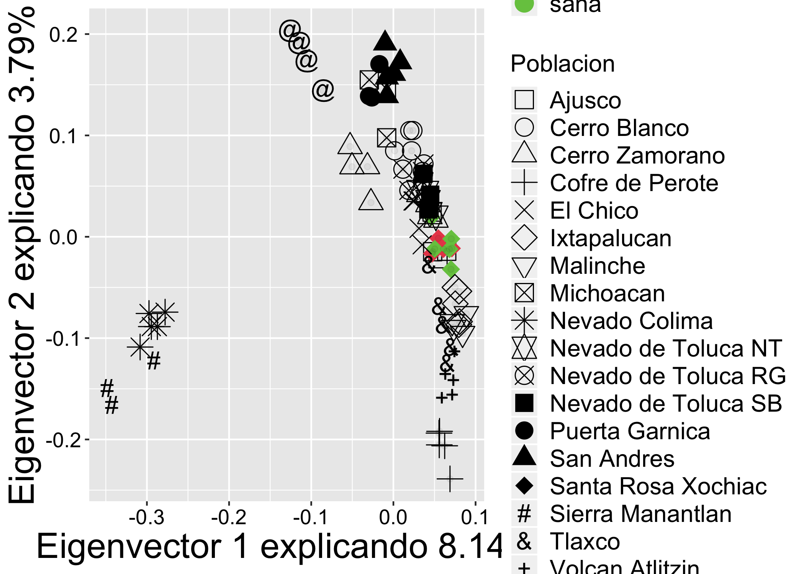

# Healthy and damaged oyameles have a local genetic origin

Using 88 individuals from 19 populations spread throughout the natural distribution of Abies religiosa (Fig. 1; above Tancite Volcano and below Perote Coffer), five genetic groups were found given by geographical location and considerable isolation between mountains (Fig. 2).

Fig. 1: PCA analysis

Fig. 2: Mantel test

Detecting the origin of individuals in this type of study is important given that different sources may have varying degrees of sensitivity to O3, and our study site has had multiple reforestation attempts with different sources of germplasm. The populations of Cofre de Perote and Nevado de Colima have been reported with less sensitivity to damage by tropospheric O3, while localities near the CDMX and the Nevado de Toluca have shown greater sensitivity (Tejeda & Meza, 2015). Therefore, there was a hypothesis that our healthy individuals came from a reforestation with germplasm of Cofre de Perote.
Our results show that among the clearly distinguishable origins are just Cofre de Perote and Nevado de Colima (Fig. 1 and 3). However, our analyzes indicate that all individuals of Santa Rosa Xochiac are grouped with local populations such as Ajusco and Nevado de Toluca NT / SB (Fig. 1 and 3). That is, our data indicate that both healthy and damaged individuals come from the same genetic group and that this corresponds to the center of the FVTM (Nevado de Toluca, Ajusco), without it being possible to determine a particular mountain of origin within this group (Fig. 3). Because the data suggest that our individuals come from a genetic group in the center of the FVTM, the ozone response of being given by genetic mechanisms would be the product of a local adaptation based on ancestral variants (“standing genetic variation”). The above provides an alternative to the idea that the origins of Cofre de Perote or Nevado de Colima are the only variants tolerant of O3 damage (Tejeda & Meza, 2015).

**Fig. 3: Admixture analysis**

Our results of structure and genetic diversity show that A. religiosa has large populations within the central FVTM complex that maintain their genetic diversity. This is important, since rapid evolutionary responses are necessary so that populations of wildlife can cope with the conditions imposed by human pollution. Therefore, adaptation is expected to occur when populations are large, with high genetic variability, and ecological opportunities for the establishment of the best genotypes in case of strong selective pressures (Alberto et al., 2013), such as high tropospheric ozone concentrations. Such seems to be the case of the population of Santa Rosa Xochiac, which shows high genetic variation.
In addition, our results show that conserving the genetic variation of forests has great implications in maintaining variation reservoirs. This variation favors the ability of people to adapt to environmental changes induced by human activities, such as pollution and climate change. There are studies of species in other O3 tolerant trees (Li et al., 2016; Seinfeld, 1989), however, these are not native species of the FVTM forests. Forests affected by tropospheric ozone in the vicinity of the CDMX are predominantly made up of oyamel, which is a species that has inhabited the FVTM for at least the last 5 million years (Jaramillo-Correa et al., 2008). In addition, oyamel is a tree related to the replenishment of the aquifers of the CDMX and forms the ecosystem in which the emblematic monarch butterfly lives.

REFERENCES

Alberto, F. J., Aitken, S. N., Alía, R., González-Martínez, S. C., Hänninen, H., Kremer, A., … Savolainen, O. (2013). Potential for evolutionary responses to climate change - evidence from tree populations. Global Change Biology, 19(6), 1645–1661. doi: 10.1111/gcb.12181

Tejeda, T. H., & Meza, H. M. B. (2015). Sensibilidad de 20 procedencias de pino y oyamel a los oxidantes fotoquímicos. Retrieved January 20, 2017, from Revista Mexicana de Ciencias Forestales website: http://www.redalyc.org/articulo.oa?id=63442410004

Jaramillo-Correa, J. P., Aguirre-Planter, E., Khasa, D. P., Eguiarte, L. E., Piñero, D., Furnier, G. R., & Bousquet, J. (2008). Ancestry and divergence of subtropical montane forest isolates: molecular biogeography of the genus Abies (Pinaceae) in southern México and Guatemala. Molecular Ecology, 17(10), 2476–2490. doi: 10.1111/j.1365-294X.2008.03762.x

Li, P., Calatayud, V., Gao, F., Uddling, J., & Feng, Z. (2016). Differences in ozone sensitivity among woody species are related to leaf morphology and antioxidant levels. Tree Physiology, 36(9), 1105–1116. doi: 10.1093/treephys/tpw042

Seinfeld, J. H. (1989). Urban Air Pollution: State of the Science. 243(4892), 745–752. doi: 10.1126/science.243.4892.745
