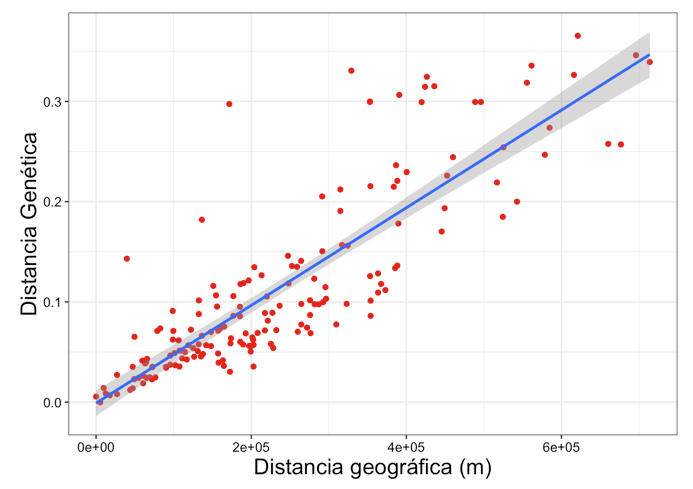
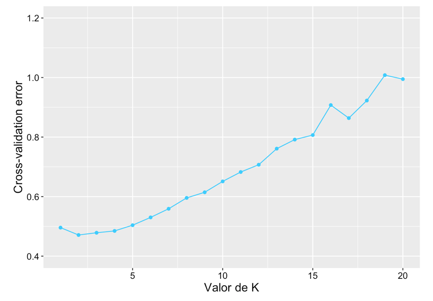

# README

## Pre-requisitos

Before starting the analysis here are the programs that need to be installed:

## SOFTWARE

* [ipyrad](https://ipyrad.readthedocs.io/en/latest/)
* [PLINK](https://www.cog-genomics.org/plink2/)
* [vcfTools](https://vcftools.github.io/man_latest.html)
* [R](https://cran.r-project.org)
* [Rstudio (optional)](https://rstudio.com)

## R packages

* []
* []
* []
* []
* []

## GENOMICS directory structure:

```
+----- Abies_religiosa_vs_ozone/
|	+--GENOMICS/
|		+--bin/
|	     +--Rstudio/
|	   	    +--3.3_Without_SNPs_in_same_loci.R
|	   	    +--4.2_Relatedness.R
|	   	    +--5.1_Mantel_test.R
|	   	    +--6.1_PCA.R
|	   	    +--7.3_Admixture.R
|	   	    +--8.2_Calculate_He.R
|	     +--Software
|	   	    +--1.1_Run_relaxed_assembly.sh
|	   	    +--2.3_Samples_missdata_maf.sh
|	   	    +--3.1_Calculate_frequences.sh
|	   	    +--3.2_ConvertFiles_vcf_to_plink.sh
|	   	    +--3.4_Extract_positions_HM.sh
|	   	    +--5.1_Calculate_relatedness.sh
|	   	    +--7.1_Calculate_CV_Admixture.sh
|	   	    +--8.1_Calculate_Heterozigozity.sh
|		+--data/
|		+--metadata/
|		+--outputs/
|		+--README_genomics.md
```


# 1.0.-RUN de novo ASSEMBLY

Relaxed assembly iPyRAD with *Abies flinckii* and *Abies religiosa*

* INPUT:
   * Archivos de la secuenciación **files.fq.gz**
   * barcodes **file.txt**

* OUTPUT:
   * **file.vcf**

## 1.1.-Run relaxed assembly with ipyrad
SCRIPT in GENETICS/Software/[1.1_Run_relaxed_assembly.sh](bin/Software/1.1_Run_relaxed_assembly.sh)

```

```
PARAMS FILE
```
------- ipyrad params file (v.0.7.28)-------------------------------------------
TMVB_5SNPradlocus              ## [0] [assembly_name]: Assembly name. Used to name output directories for assembly steps
/LUSTRE/Genetica/gibrahim/ipyrad_Abies ## [1] [project_dir]: Project dir (made in curdir if not present)
                               ## [2] [raw_fastq_path]: Location of raw non-demultiplexed fastq files
Merged: Plate1rawsAbies, Plate2rawsAbies, Plate3rawsAbies, Plate4rawsAbies, Plate5rawAbies ## [3] [barcodes_path]: Location of barcodes file
                               ## [4] [sorted_fastq_path]: Location of demultiplexed/sorted fastq files
denovo                         ## [5] [assembly_method]: Assembly method (denovo, reference, denovo+reference, denovo-reference)
                               ## [6] [reference_sequence]: Location of reference sequence file
gbs                            ## [7] [datatype]: Datatype (see docs): rad, gbs, ddrad, etc.
TGCAG, CGG                     ## [8] [restriction_overhang]: Restriction overhang (cut1,) or (cut1, cut2)
0                              ## [9] [max_low_qual_bases]: Max low quality base calls (Q<20) in a read
43                             ## [10] [phred_Qscore_offset]: phred Q score offset (33 is default and very standard)
8                              ## [11] [mindepth_statistical]: Min depth for statistical base calling
8                              ## [12] [mindepth_majrule]: Min depth for majority-rule base calling
10000                          ## [13] [maxdepth]: Max cluster depth within samples
0.9                            ## [14] [clust_threshold]: Clustering threshold for de novo assembly
0                              ## [15] [max_barcode_mismatch]: Max number of allowable mismatches in barcodes
2                              ## [16] [filter_adapters]: Filter for adapters/primers (1 or 2=stricter)
80                             ## [17] [filter_min_trim_len]: Min length of reads after adapter trim
2                              ## [18] [max_alleles_consens]: Max alleles per site in consensus sequences
0                              ## [19] [max_Ns_consens]: Max N's (uncalled bases) in consensus (R1, R2)
4, 4                         ## [20] [max_Hs_consens]: Max Hs (heterozygotes) in consensus (R1, R2)
1                              ## [21] [min_samples_locus]: Min # samples per locus for output
5, 5                         ## [22] [max_SNPs_locus]: Max # SNPs per locus (R1, R2)
4, 4                           ## [23] [max_Indels_locus]: Max # of indels per locus (R1, R2)
0.5                            ## [24] [max_shared_Hs_locus]: Max # heterozygous sites per locus (R1, R2)
0, 0, 0, 0                     ## [25] [trim_reads]: Trim raw read edges (R1>, <R1, R2>, <R2) (see docs)
0, 0, 0, 0                     ## [26] [trim_loci]: Trim locus edges (see docs) (R1>, <R1, R2>, <R2)
p, s, v, k, n, g               ## [27] [output_formats]: Output formats (see docs)
                               ## [28] [pop_assign_file]: Path to population assignment file
```

# 2.0.-Strict assembly vcfTools and PLINK
I used 79 samples of my research group to understand were is the providence of my 10 samples. So, I do my assembly with 89 samples.
This assembly was made relaxed because we want found SNPs with same ID reference in every sequences.
Se requiere sacar del ensamble general solamente a las muestras de Abies religiosa (89 individuals)

* INPUT:
   * **file.vcf**

* OUTPUT:
   * **fitered_file.vcf**

## 2.1.-Check perfect missing data max for your samples


## 2.2.-Check perfect maf for your samples

## 2.3.-Selected samples, missing data and maf. Only 89 *Abies religiosa* samples with missing data max 10% and maf 0.05
SCRIPT in GENETICS/Software/[2.3_Samples_missdata_maf.sh](bin/Software/2.3_Samples_missdata_maf.sh)

```
vcftools --vcf TMVB_5SNPradlocus.vcf --keep 89_ind.txt --max-missing 0.9 --maf 0.05 --recode --out 89ind_maxmiss0.9_maf0.05
```

# 3.0.-Make LD linkage desequilibrium (delete a SNPs in the same loci)


* INPUT:
   * **fitered_file.vcf**

* OUTPUT:
   * **fitered_file.freq**
   * **fitered_file.bed**
   * **fitered_file.bim**
   * **fitered_file.fam**
   * **positions_s88_Ar0.9.txt**
   * **extract_positions_file.**
   * **extract_positions_file.**
   * **extract_positions_file.**

## 3.1.-Primero se tiene que obtener la frecuencia que tienen los loci

SCRIPT in GENETICS/Software/[3.1_Calculate_frequences.sh](bin/Software/3.1_Calculate_frequences.sh)
```
vcftools --vcf 89ind_maxmiss0.9_maf0.05.recode.vcf --freq --out freq_89ind_maxmiss0.9_maf0.05

```


## 3.2.-Convertir archivos vcf en plink

SCRIPT in GENETICS/Software/[3.2_ConvertFiles_vcf_to_plink.sh](bin/Software/3.2_ConvertFiles_vcf_to_plink.sh)
```
vcftools --vcf 88ind_maxmiss0.9_maf0.05.recode.vcf --plink --out 88ind_maxmiss0.9_maf0.05
```
El archivo anterior se utilizó para descartar esos locus con el comando en **VCFTools**:
Mantener las variantes del txt. Este .txt se uso para descartar a estos SNPs utilizando comandos plink con los archivos map, ped y txt

## 3.3.-Utilizar el archivo .txt para extraer solamente sitios con valores de maf altos

modificar el archivo
locus_13 8
locus_13:8

SCRIPT in GENETICS/Rstudio/[3.3_Without_SNPs_in_same_loci.R](bin/Rstudio/3.3_Without_SNPs_in_same_loci.R)


## 3.4.-Extraer posisiones en archivos plink con el outfile del paso 3.3

SCRIPT in GENETICS/Software/[3.4_Extract_positions_HM.sh](bin/Software/3.4_Extract_positions_HM.sh)
```
./plink --file 88ind_maxmiss0.9_maf0.05 --extract positions_s88_Ar0.9.txt  --make-bed --out snp_withoutDupLoci_88s_maxmiss0.9_maf0.05
```


# 4.0.-Calcular coeficiente de relación (relatedness)

* INPUT:
  * **extract_positions_file.**
  * **extract_positions_file.**
  * **extract_positions_file.**

* OUTPUT:


## 4.1.-Se calcula con PLINK1.9, los archivos se convierten a plink y a vcf, utilizando los siguientes comandos:

SCRIPT in GENETICS/Software/[4.1_Calculate_relatedness.sh](bin/Software/4.1_Calculate_relatedness.sh)
```
./plink --bfile snp_withoutDupLoci_without_duplicates88s_maxmiss0.9_maf0.05 --make-rel square --make-bed --out relsnp_withoutDupLoci_without_duplicates88s_maxmiss0.9_maf0.05
./plink --bfile relsnp_withoutDupLoci_without_duplicates88s_maxmiss0.9_maf0.05 --recode --out relsnp_withoutDupLoci_without_duplicates88s_maxmiss0.9_maf0.05
./plink --file relsnp_withoutDupLoci_without_duplicates88s_maxmiss0.9_maf0.05 --recode vcf --out relsnp_withoutDupLoci_without_duplicates88s_maxmiss0.9_maf0.05
```
## 4.2.-plot Relatedness
SCRIPT in GENETICS/Rstudio/[4.2_Relatedness.R](bin/Rstudio/4.2_Relatedness.R)


# 5.0.-Mantel test

* INPUT:

* OUTPUT:

## 5.1.-
SCRIPT in GENETICS/Rstudio/[5.1_Mantel_test.R](bin/Rstudio/5.1_Mantel_test.R)



# 6.0.-Estructura genética de las poblaciones con PCA

* INPUT:

* OUTPUT:


## 6.1.-Plot PCA
SCRIPT in GENETICS/Rstudio/[6.1_PCA.R](bin/Rstudio/6.1_PCA.R)


# 7.0.-Estructura genética de las poblaciones con admixture

* INPUT:

* OUTPUT:


## 7.1.-Run admixture
Cada vez que corro un admixture debo cambiar de lugar los archivos, de lo contrario se sobreescriben

SCRIPT in GENETICS/Software/[7.1_Calculate_CV_Admixture.sh](bin/Software/7.1_Calculate_CV_Admixture.sh)
```
for K in 1 2 3 4 5 6 7 8 9 10 11 12 13 14 15 16 17 18 19 20;
do ./admixture --cv=20 snp_withoutDupLoci_88s_maxmiss0.9_maf0.05.bed $K | tee log${K}.out; done
grep -h CV log*.out > logall_snp_withoutDupLoci_88s_maxmiss0.9_maf0.05
```

## 7.2.-Modificar el logall.txt y el archivo .fam

```
CV error (K=1): 0.44124
01	0.86369

fam file

ArDlD5	ArDlD5	0	0	0	-9
SantaRosaXochiac	ArDlD5	0	0	0	-9
```
## 7.3.-Admixture Plot
SCRIPT in GENETICS/Rstudio/[7.3_Admixture.R](bin/Rstudio/7.3_Admixture.R)




# 8.0.-Calculate Heterocigozity

* INPUT:

* OUTPUT:


## 8.1.-

SCRIPT in GENETICS/Software/[8.1_Calculate_Heterozigozity.sh](bin/Software/8.1_Calculate_Heterozigozity.sh)
```
vcftools --vcf 89ind_maxmiss0.9_maf0.05.recode.vcf --he --out samples_he_snp_withoutDupLoci_89ind_maxmiss0.9_maf0.05
```
## 8.2.-Plot
SCRIPT in R GENETICS/Rstudio/[8.2_Calculate_He.R](bin/Rstudio/8.2_Calculate_He.R)
