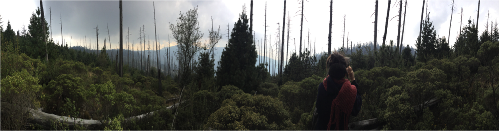

# Abies_religiosa_vs_ozone

:evergreen_tree: I am Veronica Reyes Galindo. This repository contains all the scripts of my Master's Thesis project at [Instituto de Ecología, UNAM](http://www.ecologia.unam.mx/).:evergreen_tree:

* The online version of my Thesis is in [UNAM]() website.

* You can found "The paper" and other files about my project in [my ResearchGate](https://www.researchgate.net/profile/Veronica_Reyes-Galindo).

* If you want  to know more about the importance of the project to reforest the forest near to Mexico city, you can see a nice [video](https://twitter.com/ChilangoCom/status/1028999361722761217?s=04&fbclid=IwAR2AF-Tfj_Uudgl_M0vbpxONYGhOTdIdeaDG6xD4VrQg_SFvUOPqDbJt1Uk) and read a [report](https://www.chilango.com/noticias/reportajes/desierto-de-los-leones-agoniza/amp/?__twitter_impression=true&fbclid=IwAR1kObOZYXBEytAUHqsL3OzTa3jTfeaXs8VtBfaao4tK0LjgGhIM1YAYlfE) in spanish by "Chilango" magazine.

And please send me a message in **veronica.rg.pb@ gmail.com** to clear all doubts about my Master's Thesis project. :smiley:

Photo by me: My Supervisor [PhD. Alicia Mastretta-Yanes](http://mastrettayanes-lab.org/) in middle of the "sacred fir cementery" in Santa Rosa Xochiac, 2017.

**You should continue reading [Analysis_README](https://github.com/VeroIarrachtai/Abies_religiosa_vs_ozone/blob/master/Analysis_README.md) to better understand this repository and differents workflows of my project.** :wink:

**FINALLY** Welcome to my repository!!!! :tada: :confetti_ball:

This is the repository that describes my project and the particular aims of my Master´s Thesis.

The principal aim of my project is to : **Assess if the tolerance of sacred fir (Abies religiosa) to exposure by O3, in a peripheral forest of the CDMX, is related to the genetic origin of the individuals or is given by differential expression of candidate genes.**

To resolves my general aim, I have 3 particular aims. The analyzes to answer each aim can be found in separate directories with data  and pictures:

* Evaluate the differential expression of healthy and damaged trees in two periods of [O3] ([TRANSCRIPTOMICS](https://github.com/VeroIarrachtai/Abies_religiosa_vs_ozone/tree/master/TRANSCRIPTOMICS)).

* Identify origins of sacred fir with tolerance to O3 ([GENOMICS](https://github.com/VeroIarrachtai/Abies_religiosa_vs_ozone/tree/master/GENOMICS)).

* Quantify the relative abundance of secondary metabolites in healthy y damaged trees in two periods of concentration of O3 ([METABOLOMICS](https://github.com/VeroIarrachtai/Abies_religiosa_vs_ozone/tree/master/METABOLOMICS)).

This is the Repository structure:

In addition, you can find in this repository:

:page_facing_up:  **`/Transcriptomic_analysis_about tropospheric_ozone_tolerance_in_Abies_religiosa_TB.pdf`**

PowerPoint about my project in [PDF file](https://github.com/VeroIarrachtai/Abies_religiosa_vs_ozone/blob/master/Transcriptomic_analysis_about%20tropospheric_ozone_tolerance_in_Abies_religiosa_TB.pdf)

:page_facing_up:  **`/ABSTRACT- Transcriptomic analysis about tropospheric ozone tolerance in *Abies religiosa*..md`**

[Abstract](https://github.com/VeroIarrachtai/Abies_religiosa_vs_ozone/blob/master/ABSTRACT-%20Transcriptomic%20analysis%20about%20tropospheric%20ozone%20tolerance%20in%20*Abies%20religiosa*..md) about my project

:page_facing_up:  **`/General_Discussion_and_conclusions.md`**

[General_Discussion_and_conclusions](): is a short and global discussion of my project

:page_facing_up: **`/GENERAL_README.md`**

[GENERAL_README](https://github.com/VeroIarrachtai/Abies_religiosa_vs_ozone/blob/master/GENERAL_README.md): is a summary of all my repository.

:page_facing_up: **`/README.md`**

[README](https://github.com/VeroIarrachtai/Abies_religiosa_vs_ozone/blob/master/README.md): is a intro about my project. This include links about me, my supervisor and my project.

:file_folder: **`/TRANSCRIPTOMICS`** **`/GENOMICS`** **`/METABOLOMICS`**

Three directories: [TRANSCRIPTOMICS](https://github.com/VeroIarrachtai/Abies_religiosa_vs_ozone/tree/master/TRANSCRIPTOMICS), [GENOMICS](https://github.com/VeroIarrachtai/Abies_religiosa_vs_ozone/tree/master/GENOMICS) and [METABOLOMICS](https://github.com/VeroIarrachtai/Abies_religiosa_vs_ozone/tree/master/METABOLOMICS). Each one solves one of my particular aims.

# TRANSCRIPTOMICS

### Evaluate the differential expression of healthy and damaged trees in two periods of [O3].

Check more info about this pipeline in the directory [TRANSCRIPTOMICS](https://github.com/VeroIarrachtai/Abies_religiosa_vs_ozone/tree/master/TRANSCRIPTOMICS).

# GENOMICS

### Identify origins of sacred fir with tolerance to O3.

Check more info about this pipeline in the directory [GENOMICS](https://github.com/VeroIarrachtai/Abies_religiosa_vs_ozone/tree/master/GENOMICS).

# METABOLOMICS

### Quantify the relative abundance of secondary metabolites in healthy y damaged trees in two periods of concentration of O3

Check more info about this pipeline in the directory [METABOLOMICS](https://github.com/VeroIarrachtai/Abies_religiosa_vs_ozone/tree/master/METABOLOMICS).

# Each one of these directories have inside:

:file_folder: **`/bin`**

This is a directory. It contains the scripts and html files results of the scripts.

:file_folder: **`/data`**

This is a directory. It contains a screenshot of my data, because the real data is very heavy.

:file_folder: **`/metadata`**

This is a directory. It contains .csv, .txt and other files to do the analysis.

:file_folder: **`/outputs`**

This is a directory. It contains files product of the scripts.

:page_facing_up: **`/README.md`**

This is a markdown file. It is a description file particular of this directory and analysis.

:page_facing_up: **`/Discussion and conclusion.md`**

This is a markdown file. It is a discussion particular of this section.
